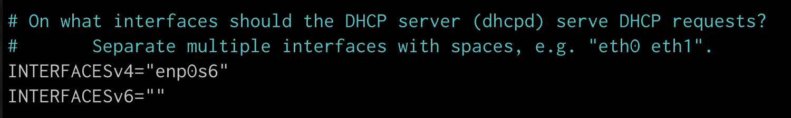
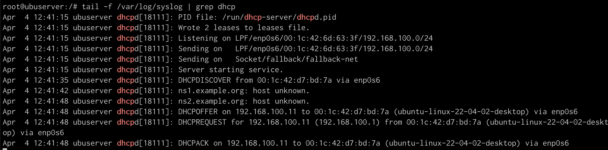
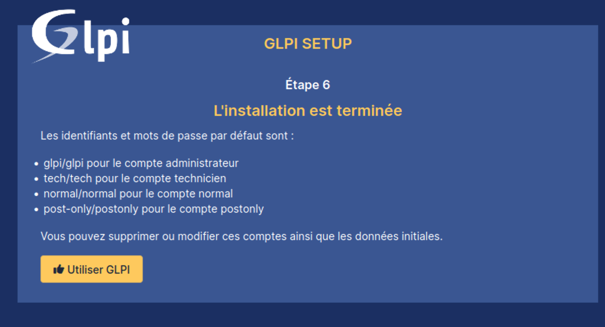

# Linux server project

## Requirements
See the [project requirements](https://github.com/becodeorg/BXL-k4MK4r-2/blob/main/content/02-Linux/09-Projects/01-Linux_Server.md)


## Server VM

### Server installation

We set up a Ubuntu server on a Parallels VM.
Download the latest LTS version of ubuntu server and proceed to install.
Nothing special to say on the install. (I didn't take screencaps 🤫)

**Network configuration**
I added a network interface (**enp0s6**) in mode **custom host-only** so I could configure the DHCP without interference from my local network.
If I only use host-only on the default interface, then I don’t have access to internet on my vm-server which is not my idea of a good time.

**enp0s5**: `10.211.55.7` (shared network)
**enp0s6:** `192.168.100.1` (host-only custom)  

For the vm-client, the new interface was up by default, but not for the server so I had to run **`sudo ip link set enp0s6 up`**
    
We can now ssh into the server from our host machine to use the more user-friendly terminal that we deserve.
`ssh ldrl@10.211.55.7`

**Static IP for the server**
We will assign this static IP `192.168.100.1` (host-only, custom, the server and the host are on this network) to the vm-server.  

We use **netplan** to assign a static IP address to the server 
`sudo nano /etc/netplan/01-netcfg.yaml`

```bash
network:
  version: 2
  renderer: networkd
  ethernets:
    enp0s6:
      dhcp4: no
      addresses:
        - 192.168.100.1/24
      gateway4: 192.168.1.1
      nameservers:
          addresses: [8.8.8.8, 1.1.1.1]
```

`sudo netplan apply` to apply the changes  
`sudo systemctl restart isc-dhcp-server` to restart the service  
`ip addr show` to check the IP  
and in the darkness...

Now the server has the address **192.168.100.1** on our host-only network.

*This static IP will be necessary to configure our DHCP server.*

### DHCP server

#### Install the dhcp server
`sudo apt install isc-dhcp-server`

#### Configure isc-dhcp server
```bash
nano /etc/dhcp/dhcpd.conf

# and add 
subnet 192.168.100.0 netmask 255.255.255.0 {
  range 192.168.100.10 192.168.100.40;
  option routers 192.168.1.1;
}
```
    
`nano /etc/default/isc-dhcp-server`
To add the interface we want to use for DHCP (enp0s6) to the file

    

#### Check configuration and installation
Display log (only lines with DHCP) and keep watching the file
```bash
sudo tail -f /var/log/syslog | grep dhcp
```

I already setup the vm-client to check that the DHCP works.
If it works, you should see something like that in the log (the vm-client needs to be up to request an IP)




#### Useful stuff
**To renew IP address**
👉🏽 To release current IP: `sudo dhclient -r` 
👉🏽 Obtain fresh IP address** `sudo dhclient`

**To see which devices are served**
👉🏽 `dhcp-lease-list` or in file: `/var/lib/dhcp/dhcpd.leases`


### DNS server

Resolve internal resources and forward queries for external domain

[How to Setup Bind (DNS Server) on Ubuntu 22.04](https://www.linuxtechi.com/install-configure-bind-9-dns-server-ubuntu-debian/)

- Server IP address: 192.168.100.1
- Router IP address: 192.168.1.1
- Domaine : support.local-library.net
- vm-client: client01

**Install BIND package**

`sudo apt install bind9 dnsutils -y`

*The `dnsutils` package provides tools for testing and troubleshooting the DNS server.*

**Configuration time** 🥲

Our configuration files are in the directory `/etc/bind`

The file `/etc/named.conf` include other files. 

We are interested by `/etc/named.conf.options`

⚠️ 🚧 Work in progress 🚧
*This section is not reliable ! I haven't really made it work yet...*

```bash
acl internal-network {
	192.168.100.0/24;
};

options {
	directory "/var/cache/bind";
  allow-query {
	  localhost; 
	  internal-network;
  };
  allow-transfer { 
    localhost; 
  };
  recursion yes;
  dnssec-validation auto;
  listen-on-v6 { any; };
	forwarders {
	   8.8.8.8; - Google DNS
	   8.8.4.4.; - Cloudflare DNS 
	};
}
```

- Répertoire /var/named
- Fichier de zones /etc/named.rfc1912.zones
- Fichier de clé /etc/named.root.key


### Internal site running GLPI (HTTP + MariaDB)

I followed this tutorial and it worked like a charm.

[Comment installer GLPI 10 sur Debian 12 ?](https://www.it-connect.fr/installation-pas-a-pas-de-glpi-10-sur-debian-12/)

**Install php, apache2 and mariadb** 

```bash
apt install apache2 php mariadb-server

# Check apache installation
systemctl status apache2
```

**Securing mariaDB (minimum)**

Run `mysql_secure_installation`

**Password**: security

❓ I said yes to everything except to the 2 questions below about only being able to connect from localhost, as I was doing everything from my machine in ssh, but maybe I should have said no ??


**Connection to mariadb**

`sudo mysql -u root -p` with password defined previously

```bash
CREATE DATABASE db_glpi;
GRANT ALL PRIVILEGES ON db_glpi.* TO glpi_admin@localhost IDENTIFIED BY "solidpassword";
FLUSH PRIVILEGES;
EXIT
```

**Dowload GLPI**

https://github.com/glpi-project/glpi/releases/

```bash
cd /tmp
wget [https://github.com/glpi-project/glpi/releases/download/10.0.14/glpi-10.0.14.tgz](https://github.com/glpi-project/glpi/releases/download/10.0.14/glpi-10.0.14.tgz)
tar -xzvf glpi-10.0.10.tgz -C /var/www/
chown www-data /var/www/glpi/ -R
```

For a more secure installation of GLPI, based on [their recommendations](https://glpi-install.readthedocs.io/en/latest/install/#files-and-directories-locations), we will move some files out of their original location.

> GLPI stores some data in the `files` directory, the database access configuration is stored in the `config` directory, etc. Even if GLPI provides some ways to prevent files from 
being accessed by the webserver directly, best practise is to store data outside of the web root. That way, sensitive files cannot be accessed directly from the web server.
> 

Source: [https://glpi-install.readthedocs.io/en/latest/install/#files-and-directories-locations](https://glpi-install.readthedocs.io/en/latest/install/#files-and-directories-locations)

```bash
mkdir /etc/glpi && chown www-data /etc/glpi/
mv /var/www/glpi/config /etc/glpi
mkdir /var/lib/glpi && chown www-data /var/lib/glpi/
mv /var/www/glpi/files /var/lib/glpi
mkdir /var/log/glpi && chown www-data /var/log/glpi
```

…etc

… All info are in this [wonderful tuto](https://www.it-connect.fr/installation-pas-a-pas-de-glpi-10-sur-debian-12/) or the GLPI docs

🌟 **Name for the internal site: support.local-library.net**

Then 

```bash
sudo a2ensite support.local-library.net.conf
sudo a2dissite 000-default.conf
sudo a2enmod rewrite
sudo systemctl restart apache2
```


⚠️ I had to use **php8.1-fpm** because php8.2-fpm was not real based on what my server said when I tried to install it.

At this point the GLPI site is accessible from the IPs 192.168.100.1 or 10.211.55.7 or with the site name [support.local-library.net](http://support.local-library.net) if the file /etc/hosts has been modified like this (our DNS are not yet configured 😅)  

```bash
192.168.100.1 [support.local-library.net](http://support.local-library.net)
10.211.55.7   [support.local-library.net](http://support.local-library.net)
```

Then we can proceed to installation in the browser.

GLPI over  🎉🎉🎉 



### Backup

Backup of configuration files sure, but which files should we backup ?

Let’s say all the files I modified dor the DHCP, DNS and GPLI configuration

```bash
# DHCP configuration
/etc/dhcp/dhcpd.conf
/etc/default/isc-dhcp-server
/etc/netplan/01-netcfg.yaml

# DNS

# Internal site GLPI
/etc/php/8.1/fpm/php.ini
/etc/apache2/sites-available/support.local-library.net.conf

/etc/glpi
```

**Backup script**

```bash
#!/bin/bash

BACKUP_DIR="$HOME/backup"
DATE=$(date +%Y-%m-%d)

# Make sure all directories exist
mkdir -p "$BACKUP_DIR/dhcp"
mkdir -p "$BACKUP_DIR/glpi/etc"
mkdir -p "$BACKUP_DIR/glpi/mysql"
mkdir -p "$BACKUP_DIR/glpi/www"

# DHCP configuration backup
cp /etc/dhcp/dhcpd.conf /etc/default/isc-dhcp-server /etc/netplan/01-netcfg.yaml "$BACKUP_DIR/dhcp"

# DNS configuration backup
# Coming soon ...

# Database
DB_NAME="db_glpi"
DB_USER="glpi_admin"
DB_PASSWORD="solidpassword"

GLPI_DIR="/var/www/glpi"

# Backup GLPI configuration files
cp -r /etc/glpi "$BACKUP_DIR/glpi/etc"

# Dump GLPI database
mysqldump -u $DB_USER  -p$DB_PASSWORD $DB_NAME > "$BACKUP_DIR/glpi/mysql/glpi-sqldump_$DATE.sql"

# Backup GLPI direcotry
tar -czf "$BACKUP_DIR/glpi/www/glpi_$DATE.tar.gz" -C "$GLPI_DIR" .

# Compress the whole archive
# Coming soon ...
```

**To make the script executable**

```bash
chmod +x backup.sh
```

**Cron jobs for the backup script**

`crontab -e` to edit cron jobs

`crontab -l` to list cron jobs

```bash
# every monday at 4am
0 4 * * 1 <command>
# or
@weekly <command>
```

I need to finish this, see todo section...

## vm-client

Compared to the server installation and configuration, the vm-client seems easy.

- Setup VM for the client in parallels ubuntu 22.04 LTS
- 🚧 I should have put the /home folder on the same disk but on a separate partition at setup so now I need to change it in flight.
I made a clone so even if mess up I won’t have to start from scratch
- We have the same network configuration than for the server with another network interface (**enp0s6**) in mode **custom host-only** so we are sure that the DHCP works without interference from the local network.
    
    **enp0s5**: `10.211.55.8` (shared network)
    
    **enp0s6:** `192.168.100.11` (host-only custom)
    
- **Check that automatic addressing works**
The range of available IPs is 192.168.100.10 - 192.168.100.40 
Our client gets:  ****`192.168.100.11` (.10 was assigned in a previous attempt)
- Installing the necessary programs:
    - **LibreOffice** was already installed
    - **Gimp**
    - 🚧 I could not install **Mullvad** because of my setup
    It works on my host machine (Apple chip) with arm64 version but on the linux vm, the linux normal package doesn’t work.
        
        
        
        We’ll pretend it work for now as this is not the hardest thing to setup in a normal environment.
        
        I would like to understand precisely why it doesn’t work though.
        

## Yet todo

- [ ]  DNS config
- [ ]  vm-client: put the /home folder on the same disk but on a separate partition
- [ ]  weekly ****cronjob for the backup script

**Optional**

- [ ]  Backups are placed on a partition located **on separate disk**, this partition must be mounted for the backup, then unmounted
- [ ]  Use a .my.cnf file for backup script
    
    Use a `.my.cnf` file instead of having the password in the script
    `nano /root/.my.cnf`
    
    ```
    [client]
    user=<db_user>
    password=<password>
    ```
    
    `chmod 600 /root/.my.cnf` 
    
    Replace mysqldump command with `mysqldump $DB_NAME > "$BACKUP_DIR/mysql/glpi-sqldump_$DATE.sql"`